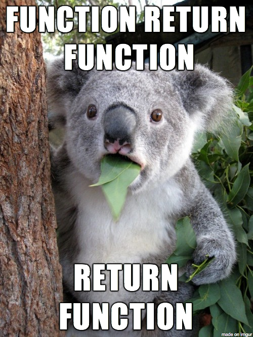
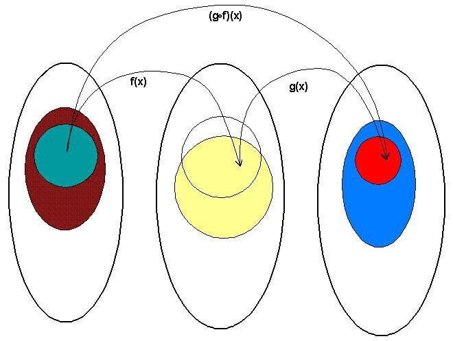
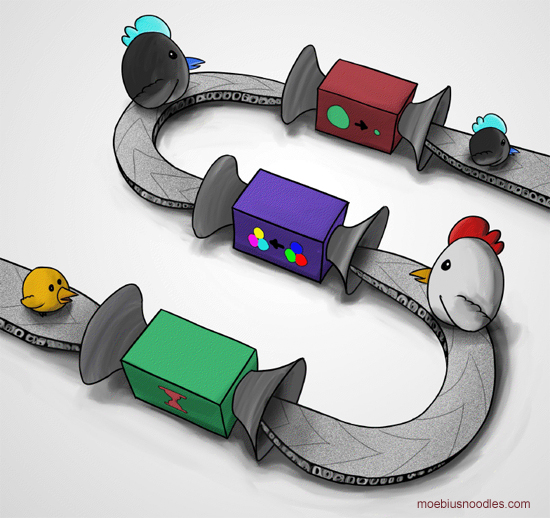

高阶函数(Higher-order function)
===============================

我们已经见识到了匿名函数和箭头函数的用法, 匿名的一等函数到底有什么用呢? 来看看高阶函数的应用.

高阶函数意思是它接收另一个函数作为参数. 为什么叫 **高阶**: 来看看这个函数 `f(x, y) ` x(y)= 按照 lambda 的简化过程则是

``` example
f(x) => (y -> x(y))
(y) => x(y)
```

可以看出来调用 f 时却又返回了一个函数x.

还记得高等数学里面的导数吗, 两阶以上的导数叫高阶导数. 因为求导一次以后返回的可以求导.

概念是一样的, 如同[俄罗斯套娃](https://en.wikipedia.org/wiki/Matryoshka_doll) 当函数执行以后还需执行或者要对参数执行, 因此叫高阶函数.


高阶函数最常见的应用如 `map`, `reduce`. 他们都是以传入不同的函数来以不同的方式操作数组元素.

另外 *柯里化*, 则是每次消费一个参数并返回一个逐步被配置好的函数.

高阶函数的这些应用都是为函数的组合提供灵活性. 在本章结束相信你会很好的体会到函数组合的强大之处.

Higher-order function
---------------------

函数在 JavaScript 中是一等公民, 因此在 JavaScript 中, 使用高阶函数是非常方便的.

### 函数作为参数

假设我现在要对一个数组排序, 用我们熟悉的 `sort`

``` javascript
  [1,3,2,5,4].sort( (x, y) => x - y )
```

如果我们要逆序的排序, 把减号左右的 `x` 和 `y` 呼唤,就这么简单, 但如果我是一个对象数组, 要根据对象的 `id` 排序:

``` javascript
  [{id:1, name:'one'},
   {id:3, name:'three'}, 
   {id:2, name:'two'}, 
   {id:5, name:'five'},  
   {id:4, name:'four'}].sort((x,y) => x.id - y.id)
```

是不是已经能够感受到高阶函数与匿名函数组合的灵活性.

### 函数作为返回值

函数的返回值可以不只是值, 同样也可以是一个函数, 来看 Eweda 内部的一个工具函数 `aliasFor`, 他的作用是给函数 E 的一些方法起一些别名:

> 听起来很怪不是吗, 函数怎么有方法, 实际上 JavaScript 的 `function` 是一个特殊 **对象**, 试试在 Firefox console 里敲 `console.log.` 是不是看到了一些方法, 但是 `typeof console.log` 是 function

``` javascript
  var E = () => {}
  var aliasFor = oldName => {
      var fn = newName => {
        E[newName] = E[oldName];
        return fn;
      };
      return (fn.is = fn.are = fn.and = fn);
  };
```

这里有两个 `return`, 一个是 `fn` 返回自己, 另一个是 `aliasFor` 也返回 `fn`, 并且给 `fn` 了几个别名 `fn.is` `fn.are`...

什么意思呢? `fn` 返回 `fn`. 很简单就是 `fn() => fn`, 那么 `fn()()=>fn()=>fn` ...以此类推, 无论调用 fn 多少次,都最终返回 fn.



这到底有什么用呢, 由于这里使用了 `fn` 的副作用(side affect) 来干了一些事情 `E[newName]=E[oldName]`, 也就是给 E 的方法起一个别名, 因此每次调用 fn 都会给 `E` 起一个别名. `aliasFor` 最后返回的是 `fn` 自己的一些别名, 使得可以 chain 起来更可读一些:

``` javascript
  aliasFor('reduce').is('reduceLeft').is('foldl')
```

> 另外, 函数作为返回值的重要应用, 柯里化与闭包, 将会在在后面专门介绍. 我们先来看下以函数作为参数的高阶函数的典型应用.

柯里化 currying
---------------

还记得 Haskell Curry吗


多巧啊, 人家姓 Curry 名 Haskell, 难怪 Haskell 语言会自动柯里化, 呵呵. 但是不奇怪吗, 为什么要柯里化呢. 为什么如此重要得让 Haskell 会默认自动柯里化所有函数, 不就是返回一个部分配置好的函数吗.

我们来看一个 Haskell 的代码.

``` haskell
  max 3 4
  (max 3) 4
```

结果都是4, 这有什么用呢.

这里看不出来, 放到 `高阶函数` 试试. 什么? 看不懂天书 Haskell, 来看看 JavaScript 吧.

### 我们来看一个问题

#### 写一个函数, 可以连接字符数组, 如 f(\['1','2'\]) =&gt; '12'

好吧,如果不用柯里化, 怎么写? 啊哈 `reduce`

``` javascript
  var concatArray = function(chars){
    return chars.reduce(function(a, b){
      return a.concat(b);
    });
  }
  concat(['1','2','3']) // => '123'
```

很简单,对吧.

#### 现在我要其中所有数字加1, 然后在连接

``` javascript
  var concatArray = function(chars, inc){
    return chars.map(function(char){
      return (+char)+inc + '';
    }).reduce(function(a,b){
        return a.concat(b)
    });
  }
  console.log(concatArray(['1','2','3'], 1))// => '234'
```

#### 所有数字乘以2, 再重构试试看

``` javascript
  var multiple = function(a, b){
    return +a*b + ''
  }
  var concatArray = function(chars, inc){
    return chars.map(function(char){
      return multiple(char, inc);
    }).reduce(function(a,b){
        return a.concat(b)
    });
  }
  console.log(concatArray(['1','2','3'], 2)) // => '246'
```

是不是已经看出问题了呢? 如果我在需要每个数字都减2,是不是很麻烦呢.需要将 `map` 参数匿名函数中的 multiple 函数换掉. 这样一来 `concatArray` 就不能同时处理加, 乘和减? 那么怎么能把他提取出来呢? 来对比下柯里化的解法.

### 柯里化函数接口

``` javascript
  var multiple = function(a){
    return function(b){
      return +b*a + ''
    }
  }

  var plus = function(a){
    return function(b){
      return (+b)+a + ''
    }
  }
  var concatArray = function(chars, stylishChar){
    return chars.map(stylishChar)
      .reduce(function(a,b){
        return a.concat(b)
    });
  }
  console.log(concatArray(['1','2','3'], multiple(2)))
  console.log(concatArray(['1','2','3'], plus(2)))
```

有什么不一样呢 1. 处理数组中字符的函数被提取出来, 作为参数传入 2. 提取成柯里化的函数, 部分配置好后传入, 好处显而易见, 这下接口非常通畅 无论是外层调用

``` example
concatArray(['1','2','3'], multiple(2))
```

还是内部的 map 函数

``` example
chars.map(stylishChar)
```

这些接口都清晰了很多, 不是吗

这就是函数式的思想, 用已有的函数组合出新的函数, 而柯里化每消费一个参数, 都会返回一个新的部分配置的函数, 这为函数组合提供了更灵活的手段, 并且使得接口更为流畅.

### 自动柯里化

在 Haskell 语言中, 函数是会自动柯里化的:

``` haskell
  max 3 4
```

其实就是

``` example
(max 3) 4
```

可以看看 `max` 与 `max 3` 函数的 类型

``` haskell
  ghci> :t max
  max :: Ord a => a -> a -> a
```

看明白了么, `Ord a =>` 表示类型约束为可以比较大小的类型, 因此 `max` 的类型可以翻译成: 当给定一个 `a`, 会得到 `a -> a`, 再看看 `max 3` 的类型就好理解了

``` example
ghci> :t max 3
(Num a, Ord a) => a -> a
```

左侧表示类型约束 `a` 可以是 `Ord` 或者 `Num`, 意思是 `max 3` 还是一个函数,如果给定一个 `Ord` 或者 `Num` 类型的参数 则返回一个 `Ord` 或者 `Num`.

现在是不是清晰了, 在 Haskell 中每给定一个参数, 函数如果是多参数的, 该函数还会返回一个处理余下参数的函数. 这就是自动柯里化.

而在 Javascript(以及大多数语言) 中不是的, 如果给定多参函数的部分参数, 函数会默认其他参数是 `undefined`, 而不会返回处理剩余参数的函数.

``` javascript
  function willNotCurry(a, b, c) {
      console.log(a, b, c)
      return a*b-c;
  }
  willNotCurry(1)
  // => NaN
  // => 1 undefined undefined
```

如果使用自动柯里化的库 [eweda](https://github.com/CrossEye/eweda), 前面的例子简直就完美了

``` example
var multiple = curry(function(a, b){
  return +b*a + ''
})
var plus = curry(function(a, b){
  return (+b)+a + ''
})
```

函数组合 function composition
-----------------------------

通过前面介绍的高阶函数, map, fold 以及柯里化, 其实已经见识到什么是函数组合了. 如之前例子中的 map 就是 由 fold 函数与 reverse 函数组合出来的.

这就是函数式的思想, 不断地用已有函数, 来组合出新的函数.



如图就是函数组合，来自 [Catgory Theory](https://en.wikipedia.org/wiki/Category_theory)（Funtor 也是从这来的，后面会讲到）, 既然从 A到B 有对应的映射f，B到 C有对应的映射g， 那么 `(g.f)(x)` 也就是 `f` 与 `g` 的组合 `g(f(x))` 就是 A到 C 的映射。上一章实现的 map 函数就相当于 `reverse.fold`.

### Compose

我们可以用 Eweda 非常方便的 compose 方法来组合函数

``` javascript
  var gf = E.compose(f, g)
```

说到了函数组合, 柯里化, 我想现在终于可以解释清楚为什么在这里选用 Eweda/Ramda 而不是 Underscore 了.

举个例子🌰 如果我现在想要 tasks 列表中所有属性为 `completed` 为 `true` 的元素, 并按照 `id` 排序.

underscore 里会这样写:

``` javascript
  _(tasks)
      .chain()
      .filter( task => task.completed===true)
      .sortBy( task => task.id)
      .value();
```

这种方式怎么看都不是函数式, 而是以对象/容器为中心的串联，有些像 jquery 对象的链式调用, 或者我们可以写的函数式一些, 如

``` javascript
  _.sortBy(_.filter(tasks, task => task.completed===true), task => task.id)
```

恩恩, 看起来不错嘛, 但是有谁是这么用 underscore的呢. 一般都会只见过 链式调用才是 underscore 的标准写法。

来对比一下用 Eweda/Ramda 解决的过程 :

``` javascript
  compose(sortBy(task=>task.id), filter(task=>task.completed===true))(tasks)
```

好像没什么区别啊? 不就是用了 compose 吗?

区别大了这, 看见 `tasks` 是最后当参数传给 `E.compose()` 的吗? 而不是写死在filter 的参数中. 这意味着在接到需要处理的数据前, 我已经组合好一个新的函数在等待数据, 而不是把数据混杂在中间, 或是保持在一个中间对象中. 而 underscore 的写法导致这一长串 `_.sortBy(_.filter())` 其实根本无法重用。

好吧如果你还看不出来这样做的好处. 那么来如果我有一个包含几组 tasks的列表 groupedTasks, 我要按类型选出 completed 为 true 并按 id 排序. 如我现在数据是这个：

``` example
groupedTasks = [
  [{completed:false, id:1},{completed:true, id:2}],
  [{completed:false, id:4},{completed:true, id:3}]
]
```

underscore:

``` javascript
  _.map(groupedTasks,
     tasks => _.sortBy(_.filter(tasks, task => task.completed===true), task => task.id))
```

看见我们又把 `_.sortBy(_.filter())` 这一长串原封不动的拷贝到了 map 里。 因为 underscore 一开始就要消费数据，使得很难重用，除非在套在另一个函数里：

``` javascript
  function completedAndSorted(tasks){
    return _.sortBy(_.filter(tasks, task => task.completed===true), task => task.id))
  }
  _.map(groupedTasks, completedAndSorted)
```

只有这样才能重用已有的一些函数。或者虽然 underscore 也有 `_.compose` 方法，但是 几乎所有 underscore 的方法都是先消费数据（也就是第一个参数是数据），使得很难放到 `compose` 方法中，不信可以尝试把 filter 和 sortBy 搁进去，反正我是做不到。

来看看真正的函数组合

``` javascript
  var completedAndSorted = compose(sortBy(task=>task.id),
                                   filter(task=>task.completed===true))
  map(completedAndSorted, groupedTasks)
```

看出来思想完全不一样了吧.

由于 Eweda/Ramda 的函数都是自动柯里化,而且数据总是最后一个参数, 因此可以随意组合, 最终将需要处理的数据扔给组合好的函数就好了. 这才是函数式的思想. 先写好一个公式，在把数据扔给 公式。而不是算好一部分再把结果给另一个公式。



而 underscore 要么是以对象保持中间数据, 用 chaining 的方式对目标应用各种函数（书上会写这是Flow-Base programming，但我觉得其实是 Monad，会在下一章中介绍）, 要么用函数嵌套函数, 将目标一层层传递下去.

### pipe

类似 compose, eweda/ramda 还有一个方法叫 pipe, pipe 的函数执行方向刚好与 compose 相反. 比如 `pipe(f, g)`, `f` 会先执行, 然后结果传给 `g`, 是不是让你想起了 bash 的 pipe

``` example
find / | grep porno
```

实际上就是 `pipe(find, grep(porno))(/)`

没错,他们都是一个意思. 而且这个函数执行的方向更适合人脑编译(可读)一些.

如果你已经习惯 underscore 的这种写法

``` javascript
  _(data)
    .chain()
    .map(data1,fn1)
    .filter(data2, fn2)
    .value()
```

那么转换成 pipe 是很容易的一件事情，而且更简单明了易于重用和组合。

``` javascript
  pipe(
    map(fn1),
    filter(fn2)
  )(data)
```
